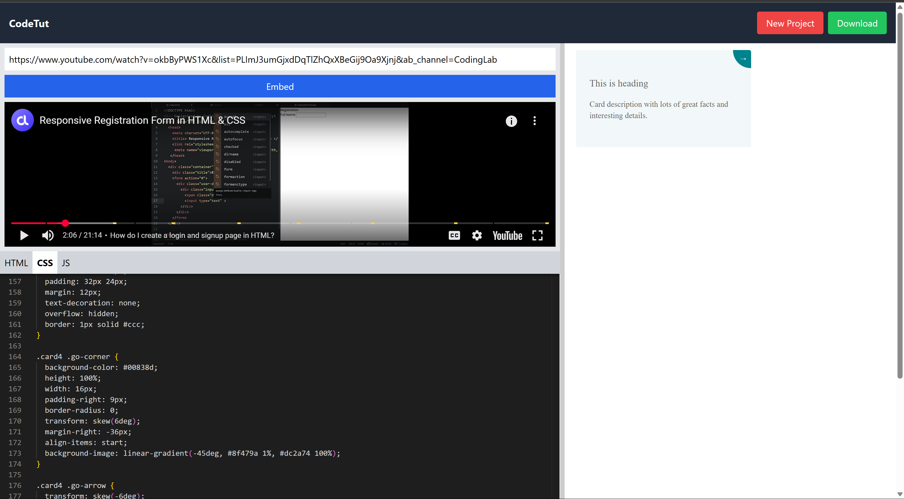

# CodeTut

CodeTut is an interactive web-based code playground that allows users to write and preview HTML, CSS, and JavaScript code in real-time. Alongside, it offers the unique feature of embedding YouTube tutorial videos, making it an excellent tool for learning through guided practice.

## 🚀 Features

- 🎨 Live code editor with separate tabs for HTML, CSS, and JavaScript
- 🧪 Real-time preview pane
- 🎥 YouTube video embed section for tutorials
- 🧭 Top menu bar for creating new projects and downloading code
- 📏 Resizable panels for flexible layout

## 🛠️ Tech Stack

- **React.js**
- **Tailwind CSS**
- **react-split** for resizable panes
- **Vanilla HTML/CSS/JS rendering inside iframe**

## 📸 Screenshot



## 🧑‍💻 Getting Started

### 1. Clone the Repository
```bash
git clone https://github.com/ayushman247/CodeTut.git
cd codetut
npm install
npm start
